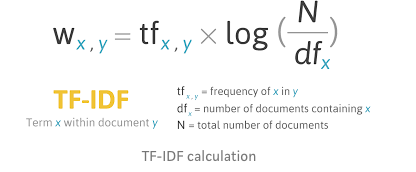

# Cherish

This is my work as a data science intern this summer at Cherish, a company with the social mission of providing free resources to parents of teenagers.

## Project 1

I created a Streamlit app, , an open-source app framework for Data Science teams. This app serves the purpose of pulling recent posts of parents of teenagers from a variety of social media outlets in order to inform the content team of Cherish on what topics to write about. These outlets include Reddit, Google Trends, and Twitter.

[Link to App!](https://intelligent-vin-24283.herokuapp.com/)

This is in the form of compiling data into downloadable csv files and generating Wordclouds to pull the most common terms.

I deployed this app using Heroku.

## Project 2

Using the `sklearn` and `pandas` packages in Python, I created a content-based recommender system. This was using the tf-idf algorithm and cosine similarity.

`for idx, row in ds.iterrows():
    similar_indices = cosine_similarities[idx].argsort()[:-100:-1]
    similar_items = [(cosine_similarities[idx][i], ds['id'][i]) for i in similar_indices]

    results[row['id']] = similar_items[1:]`
